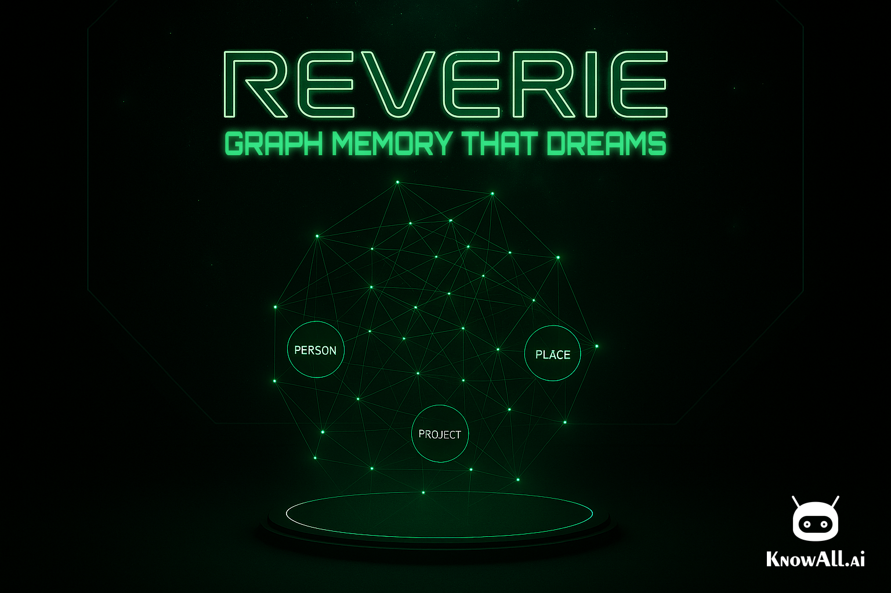

= Reverie branding
:toc: left
:toclevels: 2
:icons: font

How the Reverie banner, wordmark and icon are made, so the look can be reproduced exactly and sister products (Presence, ...) can sit in the same family. Assets live in link:brand/[`docs/brand/`]; the README banner is link:../images/reverie-banner.png[`images/reverie-banner.png`] (1536 x 1024).

== Colours

[cols="1,1,2",options="header"]
|===
| Role | Value | Notes

| KnowAll luminous green
| `#22c55e` / rgb(34, 197, 94)
| The one brand colour. Subtitle fill, glows, UI accents.

| Neon lettering (wordmark)
| approx. `#d6ffd8` core, `#22c55e` halo
| Rendered by the image model. Do not recolour; re-tint toward `#22c55e` (keeping luminance) only if a new render drifts teal.

| Backdrop
| near-black greens, `#020604` to `#0b1f14`
| Dark cinematic scene; no other hue families.

| KnowAll.ai mark
| pure white `#ffffff`
| Always the white cut of the logo on dark art.
|===

Rule from the banner review: *one colour family*. A version with amber and cyan nodes was rejected as "too many colours"; everything on-brand is green on near-black, with white for the KnowAll mark only.

== Type

[cols="1,2,2",options="header"]
|===
| Element | Face | Source

| *Wordmark* "REVERIE"
| Not a font. Outlined neon display lettering designed by gpt-image-1 from the "Logo A" concept and reused as an image.
| link:brand/reverie-wordmark.png[`brand/reverie-wordmark.png`] (RGBA cut-out, 816 x 167)

| *Subtitle* "GRAPH MEMORY THAT DREAMS"
| https://fonts.google.com/specimen/Orbitron[Orbitron], variable weight axis at *800* (ExtraBold), block capitals.
| link:brand/fonts/Orbitron.ttf[`brand/fonts/Orbitron.ttf`] (SIL OFL 1.1, licence alongside)

| Body / UI
| System sans (the portal and README use the platform default).
| --
|===

Michroma and Audiowide were the runners-up for the subtitle; Orbitron was chosen for its squarer, heavier block caps that echo the wordmark's geometry.

=== Wordmark letterforms

Monoline double-stroke outline (two thin parallel strokes with a dark fill between), extended width, wide tracking. The R has a straight diagonal leg detached from the bowl; the E is a stem with three detached bars, the middle one shorter; the V is wide; the I has a small break. The nearest real typefaces are the extended outline cuts of Eurostile, Ethnocentric and Nasalization, but none is a match: generate, do not typeset.

=== Setting a new wordmark (sister products)

The wordmark is generated, not typeset. To make a matching one for another product:

. Run gpt-image-1 with *two reference images*: `docs/brand/reverie-wordmark.png` (or the full banner) for the lettering style and the product's own backdrop for the scene. Ask for "the exact same outlined neon-green display lettering, letter for letter, on a dark plate, no other text, no icons, spelling exact".
. Key the lettering out of its dark plate (subtract the 90th-percentile border colour, alpha from luminance) to get an RGBA cut-out; re-tint the RGB toward `#22c55e` keeping luminance if it came out teal.
. Check the proportions against REVERIE: new renders tend to come out slightly condensed, so scale the cut-out horizontally until its letters have the same extended width-to-height ratio as the REVERIE lettering (about 6.1 : 1 for the seven letters of REVERIE, ink bounding box 771 x 126 px in the cut-out). Leave the stroke weight as generated.
. Use the compositing script below with that cut-out. The glow is baked into the render: the recipe adds no blur to the wordmark.

== Layout

All proportions are relative, so the same recipe works at any size.

[cols="1,3",options="header"]
|===
| Element | Rule

| Wordmark
| Centred; width *53 %* of banner width (its natural size at 1536 px); top edge at y = 62 px on a 1024 px-tall banner.

| Subtitle
| Exactly the *same width as the wordmark's ink* (the bounding box of the strokes, not the file or the glow halo); height *0.36 x* the ink height (squat and bold, stretched with Lanczos); placed *0.60 x* subtitle height below the ink's bottom edge.

| KnowAll.ai mark
| White, bottom-right, width *11 %* of banner width, *3 %* margin on both sides.

| Blending
| Wordmark and subtitle are *screen-blended* (additive light) so they glow rather than sit on top; the subtitle gets a Gaussian glow of radius about height / 6.
|===

The backdrop is a text-free render (`brand/backdrop-clean.png`): a dark control room, a window onto stars, a holographic knowledge graph on a pedestal, green monochrome, nothing decorative (no moons, no mascots, no typed text). The Agents Portal Brain tab was the style reference.

== Reproducing the banner

[source,bash]
----
pip install pillow
python3 docs/brand/composite-banner.py --out images/reverie-banner.png

# a sister product
python3 docs/brand/composite-banner.py \
    --wordmark presence-wordmark.png --backdrop presence-backdrop.png \
    --subtitle "THE MEDIA PLANE FOR KNOWALL AGENTS" --out images/presence-banner.png
----

The script encodes every rule in the layout table; its flags let you nudge one at a time. Regenerating the committed banner with it differs by a mean of about 2/255 per channel.

== Icon

link:../images/reverie-icon.png[`images/reverie-icon.png`] is the square mark for package registries and app lists: the holographic graph motif from the banner without text, on the same near-black green. Use it at 512 px or larger; there is no monochrome cut yet.

== Assets

[cols="1,2",options="header"]
|===
| File | What

| `brand/reverie-wordmark.png`
| Wordmark cut-out with alpha (the only source of the lettering).

| `brand/backdrop-clean.png`
| Text-free banner backdrop, 1536 x 1024.

| `brand/knowall-logo-white.png`
| White cut of the KnowAll.ai mark (from `knowall-website/public/images/logo.png`).

| `brand/fonts/Orbitron.ttf`, `OFL.txt`
| Subtitle typeface and its licence.

| `brand/composite-banner.py`
| The compositing recipe.
|===

== Do not

* Type the product name in a font over the art.
* Add icons, moons or mascots.
* Introduce a second colour family.
* Put the wordmark on a light background.
